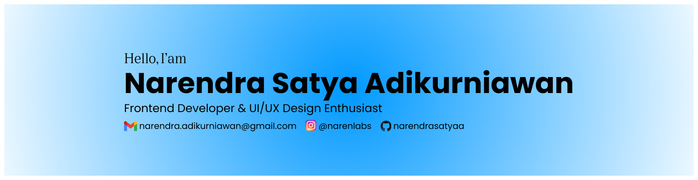

  

<h1 align="center">
Hai, I am Narendra Satya Adikurniawan 👋 
</h1>

   <strong>Welcome to my Github profile!</strong> 
   I am a <strong>Computer Science student at Universitas Muhammadiyah Surakarta</strong>, 
   based in Surakarta, Indonesia. I have a strong interest in <strong>web development</strong> and <strong>UI/UX design</strong>.

---

### 🔗 Connect with me:

---

### 💼 What I'm up to
👨🏻‍💻 I'm currently undergraduate at University of Muhammadiyah Surakarta

💬 Ask me about about anything related to  Web Developer & UI/UX 

🎓 I'm currently learning Laravel, PHP, Mobile Development with dart

📫 How to reach me:  narendra.adikurniawan@gmail.com

---

### 🧰 Languages and Tools

  
  
  
  
  

  
  

  
  
  
  

  
  

  
  
  
  

---
## 📊 My Stats:

  
    
  

---

<!-- Proudly created with GPRM ( https://gprm.itsvg.in ) -->

